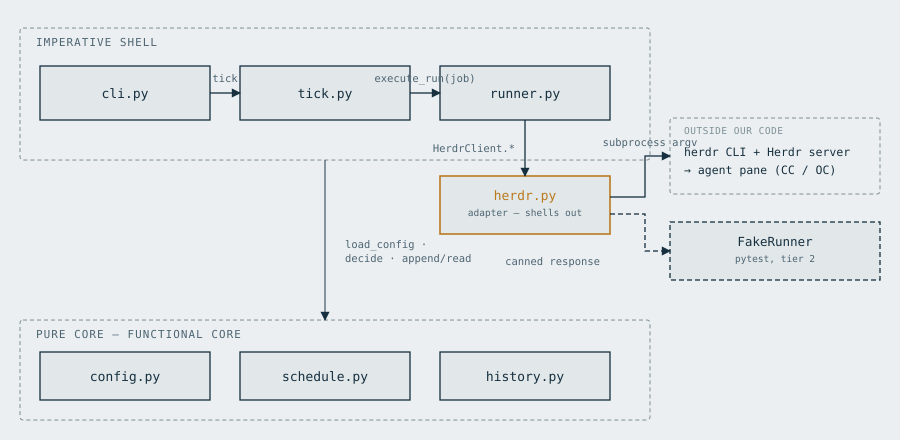

# herdr-routines

A small cron-style scheduler for [Herdr](https://herdr.dev). It runs as a `systemd` user timer,
reads a YAML job list, decides which jobs are due (with catch-up-after-downtime handling), and
drives the `herdr` CLI to spawn a pane, start a coding agent (Claude Code or OpenCode), and send
it one prompt — unattended.

Herdr has no built-in scheduler, and Claude Routines doesn't cover OpenCode or Herdr-native
workflows. This fills that gap for a single always-on host (a Raspberry Pi, in the intended
deployment) without adding a resident daemon of its own.

See [`docs/plan-v1.md`](docs/plan-v1.md) for the full design: config schema, catch-up semantics,
run history format, and test strategy.

## Architecture



A core with no subprocess/network I/O (`config.py` / `schedule.py` / `history.py` — the latter
two do read/write the YAML config and the JSONL history file, but neither shells out or talks to
Herdr) sits under an imperative shell
(`cli.py` / `tick.py` / `runner.py`); `herdr.py` is the one adapter that shells out to `herdr`,
behind a seam that's faked in tests. See
[`docs/plan-v1.md#diagrams`](docs/plan-v1.md#diagrams) for the full-run sequence diagram and a
breakdown of exactly what a Herdr API change vs. an agent-CLI change would touch.

## Status

v1 implemented and verified end to end against a real Herdr session on the laptop (see
`docs/plan-v1.md` build-order record). Deployed and running live on a Raspberry Pi. Also fully
smoke-tested on a second host (an x86_64 homelab server, more RAM headroom) as a migration
target, but deliberately kept inactive there (timer disabled) until it has a fixed physical
location — the Pi remains the live/primary scheduler. Host-specific deployment notes live
outside this repo, in each operator's own infra docs.

## Usage

```sh
uv sync
cp deploy/jobs.example.yaml ~/.config/herdr-routines/jobs.yaml   # then edit for your own jobs
uv run herdr-routines validate
uv run herdr-routines run <job> --dry-run   # eyeball the herdr argv before trusting it
uv run herdr-routines status
```

## Retention

`history.jsonl` and `reports/` only grow, so the state dir needs a policy. Two halves, and
the split is the safety argument:

- **Rotation** (opt-in via `retention:`) is a rename at the end of every tick — never a delete —
  so it is safe to run unattended. `history.jsonl` becomes `history-<UTC ts>.jsonl` and every
  reader keeps working across rolls.
- **Deletion** is explicit only: `prune` refuses without `--yes`, exactly like `gc --delete`.
  Reports belonging to an in-flight pipeline run are protected regardless of age.

```sh
uv run herdr-routines prune reports --dry-run   # list what is collectable, delete nothing
uv run herdr-routines prune reports --yes       # collect it
uv run herdr-routines prune history --dry-run   # rolled history files older than a year
```

See [`docs/plan-v1.md`](docs/plan-v1.md#retention) for the policy, the thresholds, and the
`first_seen_at` caveat on pruning history.

See [`deploy/README.md`](deploy/README.md) for the systemd units and deployment smoke checklist.

## Development

```sh
uv sync --dev
uv run pytest
uv run ruff check .
uv run ruff format --check .
```
