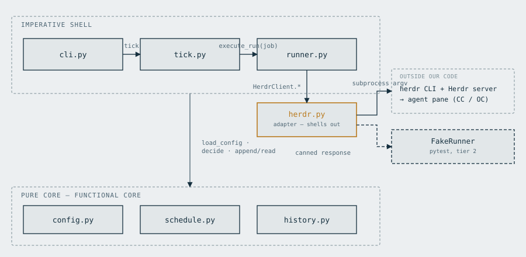
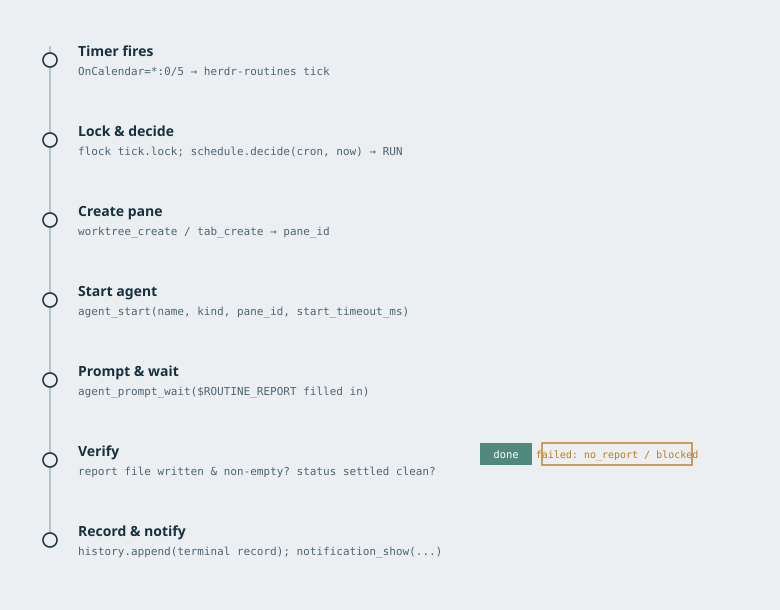

# herdr-routines v1 — implementation plan

## Context

Herdr has no built-in scheduler. Claude Routines covers Claude Code in the cloud, but not
OpenCode, and not Herdr-native workflows on my own hardware. Three community plugins exist
(DnzzL/herdr-automations, ram4-dev/herdr-automations, mikedclarke/herdr-shepherd) — all 1–3
stars, all unproven; we take design learnings from them but no dependency. Omnigent was tried
and dropped — see `~/projects/agent-orchestrator-research/herdr.md`.

### Three corrections to the brief's premises (checked against the research repo)

Worth recording, because two of them change how much confidence this plan can claim:

1. **Omnigent's drop is recorded in `herdr.md:35-39`, not `comparison.md` — and the two bugs are
   not the cited reason.** `comparison.md:39` actually *recommends* Omnigent; `herdr.md`
   supersedes it. The stated reasons are: the declarative YAML spec turned out not to be needed
   (scripting the `herdr` CLI suffices), Herdr gained native `worktree` support, and weight
   (a single binary vs. Docker Compose + Postgres on a Pi). The two bugs are real and documented
   (`comparison.md:47-50` on scheduled-task prompt injection never reaching native-terminal
   harnesses; `opencode-native-model-catalog-gap.md` on `_PROVIDER_RESOLUTION_HARNESS` having zero
   `opencode` entries, causing a run to trust a false preflight) — they are just not what the
   decision was written on. Nothing here changes the decision; it stays.
2. **`scheduling.md` contains no systemd-timer-vs-daemon analysis.** The `opencode-scheduler`
   reference is a single unevaluated sentence. There was no prior comparison to lean on — but
   Herdr's own docs have since supplied one, so §3's choice is now externally backed rather than
   just my reasoning. See §8.
3. **The three community plugins appear nowhere in the research repo** (grepped). Their design
   learnings in the brief therefore had no verifiable provenance — so I checked them directly.
   **They hold up: the brief's summary was accurate.** Full findings in §8.

The research repo also carries a meta-lesson this plan takes seriously: its standing pattern is
that **unattended scheduled runs fail silently and plausibly** (Omnigent's `/tasks` form silently
defaulting to UTC; an agent trusting a false-negative preflight and substituting fabricated
reviews). That is the argument for §6's post-run verification rather than trusting an exit code.

Outcome wanted: a small tool that, on a cron-style schedule, spawns a fresh Herdr pane, starts
a coding agent in it (claude or opencode), sends it one prompt, and records what happened — so
overnight/recurring agent work happens without me driving it, and I can check results in the
morning.

Target host is the Pi 5 (aarch64, Raspberry Pi OS Bookworm, always-on, `ssh guido@raspberrypi.local`).
Development and first smoke-testing happen on the laptop (x86_64), where Herdr already runs.

### Verified facts this plan rests on

Checked directly against `herdr 0.8.2` on this machine, not from memory:

- **The CLI works headless.** `env -i HOME=/home/guido PATH=... herdr workspace list` returned
  valid JSON with exit 0 — no `HERDR_*` vars, no TTY. The client finds the server at the fixed
  path `~/.config/herdr/herdr.sock`, so a systemd **user** service can drive Herdr without
  inheriting a pane's environment. This was the single load-bearing feasibility unknown.
  **This contradicts `herdr.md:32`**, which says Herdr "isn't meaningfully drivable headlessly
  from an agent shell." That note is right about bare `herdr` (which launches/attaches the TUI)
  and wrong about the subcommand groups, which are pure socket-API clients. The whole design
  rests on this distinction, which is why it was verified by running it rather than read.
- `loginctl show-user guido -p Linger` → `Linger=yes`, so user units survive logout.
- `herdr server` exists as a documented "Run as headless server" mode — the Pi can host a
  server with no attached client.
- Real command surface (from `herdr <group>` help output):
  - `herdr worktree create [--cwd PATH] [--branch NAME] [--base REF] [--label TEXT] [--no-focus]`
  - `herdr workspace create [--cwd PATH] [--label TEXT] [--env K=V] [--no-focus]`
  - `herdr tab create [--workspace ID] [--cwd PATH] [--label TEXT] [--env K=V] [--no-focus]`
  - `herdr agent start <name> --kind KIND --pane ID [--timeout MS] [-- <agent-args...>]`
  - `herdr agent prompt <target> <text> [--wait] [--until STATUS]... [--timeout MS]`
  - `herdr agent get <target>` / `herdr agent read <target> --source recent-unwrapped --lines N`
  - `herdr worktree remove --workspace ID [--force]`, `herdr workspace close <workspace_id>`
  - `herdr notification show <title> [--body TEXT] [--sound none|done|request]`
  - kinds include both `claude` and `opencode`.
- **`agent start` never creates layout** — it requires an existing shell pane at its prompt. So
  every run must create its own workspace/tab first and read `.result.root_pane.pane_id`.
- Agent names must match `[a-z][a-z0-9_-]{0,31}` and be **unique among live agents**.
- **Correction, checked empirically rather than trusted from docs:** SKILL.md claims `idle`
  requires the tab to have been *seen* in the focused Herdr UI, and that unseen completion shows
  as `done` instead. Verified against the live session (`pane split --no-focus` → `agent start`
  → `agent prompt --wait`, pane never focused throughout): the settled state was **`idle`**, not
  `done`, on herdr 0.8.2. The documented `done`/`idle` distinction either doesn't hold in
  practice or depends on a condition this test didn't trigger. Consequence for `runner.py`: map
  **both** `idle` and `done` to success (which the design already did defensively — this fixes
  the plan's narrative, not the mapping), `blocked` → needs-me, `unknown` → `interrupted_unknown`,
  never success.
- Error codes to map: `agent_not_ready` (blocked during startup; the name stays usable for
  `read`/`send-keys`), `agent_blocked` (prompt rejected *before* any input was sent),
  `agent_prompt_stalled` (no lifecycle change within 5 s). `agent start` startup timeout defaults
  to 30 s — raise it explicitly via `--timeout`, since a cold agent on a Pi is slower than on the
  laptop where that default was chosen.
- Dev-ergonomics trap: **`herdr <group> <sub> --help` silently falls through to top-level help.**
  Bare `herdr <group>` is the only way to get real per-subcommand syntax. Also
  `herdr api schema` is the machine-readable authority — dump it once and keep it as a test
  fixture (see §7 tier 2).
- CLI server errors are JSON on stderr with exit 1; syntax errors exit 2. Most commands return
  JSON on stdout — parse IDs from responses, never predict them.
- **Alternate-screen caveat:** Claude Code and OpenCode render on the terminal's alternate
  screen, so rows that scroll away never enter Herdr's scrollback and `agent read` cannot
  recover them. Herdr's own documented fallback is to have the agent write its output to a file
  and reply with the path. This drives the results design below.
- Repo state: fresh uv scaffold, Python 3.13, zero runtime deps, no package dir, no
  `[build-system]`, no `[project.scripts]`, `tests/__init__.py` empty, `main.py` a stub. CI runs
  `ruff format --check` + `ruff check` only — **no test job** (the workflow comment saying "no
  test suite yet" is now stale). Reuse the CI/pre-commit/dependabot layer; do not re-create it.
- TZ is `America/Montevideo`. Uruguay has had **no DST since 2015**, so the DST fall-back
  double-fire is not reachable on this host — but the design below makes it structurally
  impossible anyway, at no cost.

---

## Diagrams

Three figures, referenced from the sections below. Source SVGs are in
[`docs/diagrams/`](diagrams/); each embeds a text alternative for non-visual readers.



**Fig. A — layers and the adapter seam.** The split discussed in §1: a pure core with no I/O,
an imperative shell around it, and `herdr.py` as the one adapter that shells out — with two
implementations, real and faked, behind the same `HerdrClient` interface.



**Fig. B — one tick, traced.** The control flow described across §3–§6, start to finish, for a
single due job.


**Fig. C — blast radius of a Herdr change vs. an agent-CLI change.** The practical payoff of the
adapter seam: a Herdr API change is a small, localized edit; a provider (OpenCode / Claude Code)
CLI change reaches this codebase not at all today, since nothing provider-specific is passed
through yet (see `Job.model`, parsed but not wired into `agent_start`).

---

## 1. Language & module layout

Python 3.13, this repo's uv setup. Convert the virtual project to a packaged one: add
`[build-system]` (hatchling), a `src/` package, and `[project.scripts]`.

```
src/herdr_routines/
  __init__.py
  config.py      # YAML -> Job dataclasses, validation                (pure)
  schedule.py    # cron expansion, due/missed/skip decision            (pure)
  history.py     # JSONL append + read-back, last-run, staleness       (pure-ish, file I/O)
  herdr.py       # thin typed wrapper over the herdr CLI (subprocess)  (impure, only place)
  runner.py      # orchestrates one job run using herdr.py + history   (impure)
  tick.py        # the systemd entrypoint: lock, load, decide, run     (impure)
  cli.py         # argparse: tick | status | history | validate | run
tests/
  test_schedule.py  test_config.py  test_history.py  test_runner.py
  conftest.py
```

`main.py` is deleted; `[project.scripts] herdr-routines = "herdr_routines.cli:main"`.

**Runtime deps: `pyyaml` and `croniter`.** `croniter` is chosen specifically for
`get_prev()`/backward iteration, which is the exact primitive the catch-up logic needs. CLI is
stdlib `argparse` — a single-user tool with five subcommands does not need typer/click. Both
deps are pure Python, so aarch64 is a non-issue. **Pin them** (`==`) rather than floating, since
`dependabot.yml`'s pip ecosystem is currently idle precisely because ranges float.

The `pure` / `impure` split at `herdr.py` is what makes the test strategy in §7 possible — it is
the whole reason for the layering.

---

## 2. Config format

Single file, `jobs.yaml`. Path resolution: `--config` > `$HERDR_PLUGIN_CONFIG_DIR/jobs.yaml` >
`~/.config/herdr-routines/jobs.yaml`. The middle entry costs one line now and is what keeps the
optional plugin manifest in §8.4 available later without moving files around.

```yaml
version: 1

defaults:                      # merged under every job; all keys optional
  agent_kind: claude
  workspace: worktree          # worktree | root
  timeout_ms: 1800000          # 30 min
  catch_up_minutes: 120
  timezone: America/Montevideo

jobs:
  - name: nightly-dep-audit    # [a-z][a-z0-9_-]{0,23}; used to build the agent name
    enabled: true
    cron: "0 3 * * *"          # 5-field, standard cron
    repo: /home/guido/projects/fitted
    workspace: worktree        # worktree -> herdr worktree create; root -> tab in repo cwd
    base: main                 # worktree mode only; --base for the new branch
    agent_kind: opencode
    model: null                # passed after `--` as the agent's native arg; null = agent default
    prompt: |
      Review the dependency tree for known CVEs and unpinned versions.
      Write your findings to $ROUTINE_REPORT as Markdown. Do not commit or push.
    timeout_ms: 2700000       # prompt --wait timeout
    start_timeout_ms: 120000  # agent start timeout; herdr's own default (30s) is tight for a
                              # cold Claude Code/OpenCode boot, esp. on a Pi
    catch_up_minutes: 120
    on_missed: log             # log | notify
```

Notes on the schema:

- `name` is the identity key everywhere (history, agent name, branch name, report filename).
  Capped at 24 chars because the live agent name is `rt-<name>` and Herdr caps names at 32.
- `prompt` gets `$ROUTINE_REPORT` (and `$ROUTINE_JOB`, `$ROUTINE_RUN_ID`) substituted before
  sending — see §6.
- **No `permission_mode` key in v1.** Deliberate: scheduled + unattended + auto-approve is the
  one combination where a single bad prompt becomes an unreviewable repo mutation, and worktree
  isolation does not contain it (worktrees share the object store and can push). v1 launches
  agents with default permissions; if a job blocks on an approval, the run ends as `blocked` and
  waits for me. Adding a skip-permissions escape hatch is a v2 decision made with evidence from
  real runs, not a v1 default. And there is a better answer than auto-approving, already present
  on this machine: `herdr-push` is installed and **verified working** (`herdr plugin action invoke
  test --plugin herdr.push` → HTTP 200, notification received in Telegram), and its headline
  feature is one-tap approval from the phone. A run that blocks at 03:00 is answerable from bed
  without granting a scheduled agent blanket permissions. That is the v2 direction for `blocked`,
  not `--dangerously-skip-permissions`.
- `validate` subcommand checks the whole file: unknown keys rejected, cron parseable, `repo` is
  an existing git worktree root, `agent_kind` is in the kind list, names unique.

---

## 3. How it runs on the Pi

**Two systemd user units, no daemon of our own.**

`herdr-server.service` (may already be wanted for the Pi regardless of this project):

```ini
[Unit]
Description=Herdr headless server
[Service]
Type=simple
ExecStart=%h/.local/bin/herdr server
Restart=on-failure
[Install]
WantedBy=default.target
```

`herdr-routines.timer` + `.service`:

```ini
# timer
[Timer]
OnCalendar=*:0/5            # every 5 minutes
Persistent=true
AccuracySec=30s
[Install]
WantedBy=timers.target

# service
[Unit]
After=herdr-server.service
Wants=herdr-server.service
[Service]
Type=oneshot
WorkingDirectory=%h/projects/herdr-routines
ExecStart=/home/guido/.local/bin/uv run herdr-routines tick
TimeoutStartSec=3900        # NOT infinity — see below. Max job timeout + margin.
```

**`TimeoutStartSec` must be finite.** A tick blocks on `agent prompt --wait`, so the naive value
is `infinity` — and that is a trap. If the Herdr server dies mid-run or the socket goes away, an
`infinity` unit never gets reclaimed, and because systemd will not double-start a `oneshot`, **one
wedged tick silently disables every job forever.** That is the same failure §4's staleness rule
fixes at the JSONL layer, and it needs fixing at the process layer too. Set it to the largest job
`timeout_ms` plus margin; `validate` asserts the unit's value covers the largest configured
timeout and tells me to bump it otherwise. A wedge then surfaces as a `failed` unit in
`systemctl --user status` instead of a permanent silent stall.

Rationale for the timer over a daemon — and note that **all three community plugins chose a
daemon and this plan deliberately does not** (§8 argues why the platform is on our side here):
nothing needs to be resident. State lives in two files;
the decision "am I due" is a pure function of (config, history, now). A timer gets restart-on-
boot, journald logging, and failure visibility for free, and there is no process to leak, crash
silently, or keep warm. The 5-minute cadence must be finer than the finest cron granularity I
actually use; 5 min means a `0 3 * * *` job starts within 5 minutes of 03:00, which is fine.

`Persistent=true` only guarantees a tick shortly after boot — it does **not** do the catch-up.
That is §4's job, and the two are deliberately independent.

Deployment: `uv sync` on the Pi, `systemctl --user enable --now herdr-routines.timer`. Units live
in `deploy/systemd/` in this repo with a short `deploy/README.md`; installation is a documented
`install-units.sh` (copy + `daemon-reload` + `enable`), not silent automation.

Two Pi-specific steps that are easy to miss, both from `host-persistence.md`:

- **`sudo loginctl enable-linger guido` on the Pi.** It is already `yes` on this laptop, so the
  laptop smoke test will not catch its absence; without it, user units die at logout and nothing
  fires overnight. Verify with `loginctl show-user guido --property=Linger`.
- Units must be non-interactive. A unit that can prompt for anything hangs forever, because
  systemd has no way to answer it.

**The Pi's clone is a separate clone.** `filesystem-and-sync.md` is explicit that Herdr has no
sync mechanism — the repo lives wherever the server process runs. So `repo:` paths in `jobs.yaml`
are **Pi-local** paths, the Pi's clone is the source of truth for anything a routine touches, and
the laptop is for review and one-off work on a different clone, reconciled only through git. This
means `jobs.yaml` is host-specific and should not be committed to this repo as if it were shared
config; `deploy/jobs.example.yaml` is committed, the live file is not.

**Blocking-tick consequence, stated plainly:** because `agent prompt --wait` blocks, a tick can
occupy the service for the whole agent run, and systemd will not start a second instance of a
`oneshot` service while one is running. That is the behaviour we want (it *is* the global
concurrency cap), but it means a long job delays other jobs' start times by up to one run. For a
personal tool with a handful of nightly jobs this is acceptable; if it stops being acceptable,
the fix is per-job units, not a daemon.

**Prerequisite:** Herdr is not yet installed on the Pi (it is an open item in
`~/projects/raspberrypi/roadmap.md` §3). Until it is, v1 runs and is smoke-tested on the laptop.
This is a real dependency, not a footnote.

---

## 4. Catch-up after downtime

**The tick is stateless; the history file is the clock.** Per enabled job, at each tick:

1. `last` = timestamp of the most recent **terminal** run for this job in the JSONL
   (`done|failed|skipped|missed|interrupted_unknown`). If the job has never run, `last` = the
   time the job was first *seen* by a tick, recorded as a `registered` record on first sight.
   Without that seeding, a brand-new daily job with a 2 h grace backfills immediately on the
   next tick — wrong, and the kind of bug that only shows up the first night.
2. Enumerate cron occurrences in the half-open interval `(last, now]`, in the job's timezone.
3. Empty → not due, done.
4. Non-empty → take **only the latest** occurrence. If `now - occurrence <= catch_up_minutes`,
   run it. Otherwise write one `missed` record for it and run nothing.
5. Any earlier occurrences in the interval are collapsed into **one** `missed` record carrying a
   `skipped_occurrences` count and the first/last timestamps — not one record each. An overnight
   outage with an hourly job would otherwise write eight near-identical lines.

This is deliberately the community plugins' option (a) *and* option (b) layered together: the
grace window from (a) makes a 03:00 job that was missed by a 03:40 reboot still run, and
"latest occurrence only" from (b) prevents a boot-time thundering herd of backfilled runs. Either
alone is worse. `catch_up_minutes: 0` gives option (c) for jobs where a late run is pointless.

**DST fall-back needs one explicit dedup step, not none — this was verified empirically, not
assumed.** The original draft of this plan claimed the half-open `(last, now]` interval made DST
a non-issue "by construction." That turned out to be wrong: a repeated local wall-clock hour
genuinely produces two distinct UTC instants that both match the same cron time, and croniter
correctly enumerates both — so a naive implementation *does* fire twice. The fix, confirmed by
`test_dst_fallback_fires_exactly_once` (run against `Europe/Madrid`, since Montevideo has had no
DST since 2015 and can't exercise this): occurrences are deduplicated by their **naive local
wall-clock time**, keeping only the chronologically first (pre-fallback) instant for any local
time that repeats. One `set` and a few lines in `schedule._occurrences_since`, not zero lines.

**Concurrency and wedged runs — two failure modes worth naming:**

- **Overlapping ticks:** the tick takes an exclusive `flock` on
  `~/.local/state/herdr-routines/tick.lock` and exits quietly (rc 0) if it cannot get it. Cheap
  insurance against two processes appending the same JSONL, and it makes the "skip, never queue"
  rule automatic.
- **A `running` record with no terminal record** (tick killed, power cut mid-run): treated as
  stale once `now > started_at + timeout_ms + 5 min`, rewritten as `interrupted_unknown`, and it
  does **not** block the next run. Without this rule, one crash silently disables a job forever
  until I hand-edit JSONL — the exact failure the plugins hit.
- Also skip (recording `skipped`, reason `agent_name_live`) if `herdr agent list` already shows a
  live `rt-<name>`.

---

## 5. Run history & inspection CLI

Append-only JSONL at `$HERDR_PLUGIN_STATE_DIR/history.jsonl` if set, else
`~/.local/state/herdr-routines/history.jsonl` (same forethought as §2). One line per state
transition, so the file is a log, not a mutable record set.

```json
{"ts":"2026-08-22T06:00:04Z","run_id":"nightly-dep-audit-20260822T030000Z",
 "job":"nightly-dep-audit","state":"running","scheduled_for":"2026-08-22T06:00:00Z",
 "late_seconds":4,"workspace_id":"w7","pane_id":"w7:p1","agent":"rt-nightly-dep-audit",
 "branch":"auto/nightly-dep-audit-20260822T030000Z"}
{"ts":"2026-08-22T06:31:12Z","run_id":"...","job":"...","state":"done",
 "duration_seconds":1868,"final_agent_status":"idle","report":"/home/guido/.local/state/herdr-routines/reports/....md"}
```

States: `registered`, `scheduled`, `running`, `done`, `failed`, `skipped`, `missed`,
`interrupted_unknown`. `failed` carries `error` and `stderr_tail`; `skipped`/`missed` carry
`reason`.

CLI:

- `herdr-routines status` — one line per job: last run, its state, next scheduled occurrence,
  whether currently running. This is the morning check-in.
- `herdr-routines history <job> [-n N] [--json]` — recent runs for one job.
- `herdr-routines validate` — config check, exits non-zero on error. Also used in CI.
- `herdr-routines run <job> [--dry-run]` — force one run now, ignoring the schedule.
  `--dry-run` prints the exact `herdr` argv it would execute and exits. This is the debugging
  tool that makes §7 tier-3 verification tractable.
- `herdr-routines tick` — what systemd calls.

No log rotation in v1; a handful of jobs writing a few lines a day will not matter for years.

---

## 6. How results reach me

**Three layers, all cheap, and the middle one is the important one.**

1. **A report file the agent writes itself.** Every run gets
   `~/.local/state/herdr-routines/reports/<run_id>.md`, and the path is substituted into the
   prompt as `$ROUTINE_REPORT`. This is not a nice-to-have — it is the *only* reliable way to get
   an agent's conclusions out, because Claude Code and OpenCode both render on the alternate
   screen and `herdr agent read` structurally cannot recover scrolled-away output. Herdr's own
   docs name file-output as the fallback for exactly this. Making it the default for scheduled
   runs (where nobody is watching the pane live) is the right inversion.
2. **A pane-tail snapshot**, best-effort: `herdr agent read <agent> --source recent-unwrapped
   --lines 200` captured at run end into `reports/<run_id>.tail.txt`. Diagnostic only — it may be
   truncated or empty, and the plan does not pretend otherwise.
3. **`herdr notification show`** on terminal state, with `--sound done` on success and
   `--sound request` on failure. Free, native, and it is what makes an overnight failure visible
   without me remembering to run `status`.

**The tradeoff, stated:** Herdr's own status view alone is *not* enough, and it would be wrong to
claim it is. It shows live pane state, which is exactly the thing that is gone by morning. The
JSONL answers "did it run, how long, did it succeed"; the report file answers "what did it
conclude." Layer 1 costs one line in every prompt and depends on the agent actually complying —
so at run end `runner.py` performs an explicit **post-run verification** rather than trusting the
settled state: was the report file created, is it non-empty, and was the settled state `done`/`idle`
rather than `unknown`? Each answer is recorded (`report_written`, `report_bytes`,
`final_agent_status`), and a run that settled cleanly but produced no report is written as
`failed` with reason `no_report`, not `done`. This is a direct response to the research repo's
standing pattern that unattended scheduled runs fail *silently and plausibly* — an exit code and a
lifecycle state are both satisfiable without any real work having happened. What v1 does **not** do is aggregate
into a daily digest or push anywhere off-box (the `herdr-push`/Telegram relay in the Pi roadmap
is the natural v2 home for that).

**Worktree cleanup is manual and opt-in.** Runs leave their workspace and `auto/<name>-<ts>`
branch in place; a `herdr-routines gc --dry-run` that lists merged-or-empty auto branches is a
v2 item. Nothing is ever removed automatically — a scheduled tool that deletes branches while I
sleep is not a tool I want. v1 jobs are also told, in the prompt template, not to push.

---

## 7. Test strategy

Three tiers, and the third one is not automatable — saying otherwise would be the main way this
plan could mislead.

**Tier 1 — pure, fully unit-tested (the real coverage).** This is where the actual logic lives,
which is the point of the §1 layering.
- `schedule.py`: frozen `now` + fixture history → assert due / missed / skip. Cases that must be
  in the suite: never-run-before job (must not backfill); inside grace; outside grace; multiple
  missed occurrences collapsing to one record with the right count; `catch_up_minutes: 0`;
  and a fall-back DST date in a zone that *has* DST (e.g. `Europe/Madrid`) asserting exactly one
  fire — deliberately testing a zone we don't deploy in, because Montevideo can't exercise it.
- `config.py`: valid file, unknown key, bad cron, name too long, duplicate names, defaults merge.
- `history.py`: append/read round-trip, `last terminal run` selection ignoring non-terminal
  states, staleness rule promoting an orphaned `running` to `interrupted_unknown`.

**Tier 2 — testable against a fake.** `herdr.py` sits behind a small protocol; tests assert **the
argv that would be built** and feed back canned JSON / exit codes / timeouts. This is how "shell
out to a CLI" becomes testable: we test command *construction* and *response handling* — worktree
vs root mode producing different creation calls, pane ID parsed from `.result.root_pane.pane_id`,
exit 1 + JSON stderr becoming `failed`, exit 2 becoming a hard config error, `agent_blocked`,
`agent_not_ready` and `agent_prompt_stalled` mapping to the right terminal states, and — the case
most likely to be got wrong — `done` and `unknown` mapping to success and `interrupted_unknown`
respectively. No `herdr` binary involved. Canned responses come from a committed
`tests/fixtures/api-schema.json` dumped once via `herdr api schema --output`, plus recorded real
JSON responses, so the fake is shaped by the actual API rather than by my assumptions about it.

**Tier 3 — needs a real host; no substitute exists.** A green suite proves nothing here.
- That the argv is actually *correct* against `herdr 0.8.2` (tiers 1–2 test our model of the CLI,
  not the CLI).
- That the systemd user service's environment really works: `herdr` on PATH, `uv` resolvable,
  `HOME` right, socket reachable with no `HERDR_*` inherited. Verified headless-with-scrubbed-env
  on the laptop already; must be re-verified under systemd, and again on the Pi.
- That a worktree run truly isolates, and that an agent started this way reaches `idle`/`done`.
- Manual smoke checklist, in `deploy/README.md`, in order:
  1. `herdr-routines validate`
  2. `herdr-routines run <job> --dry-run` — eyeball the argv
  3. `herdr-routines run <job>` from an interactive shell, watching the pane
  4. `systemd-run --user --scope herdr-routines run <job>` — proves the systemd env
  5. enable the timer with one short-cron throwaway job; confirm one fire, one JSONL pair, one
     report file, one notification
  6. `systemctl --user stop herdr-server` mid-run once, to see `failed` rather than a hang

CI change: add the `Tests (Python)` job (`uv run pytest`) that `ci.yml`'s own comment says is
pending — pytest and `tests/` now exist, so that comment is stale. Also add `[tool.ruff]` with
`extend-exclude = ["docs"]` **before** any docs land, since ruff ≥0.13 formats Python fences
inside Markdown and would otherwise fail `ruff format --check .`. And align the ruff version
skew: `.pre-commit-config.yaml` pins v0.15.12 while dev deps want ≥0.16.4, and both versions
have already run against this tree.

---

## 8. Prior art — the `awesome-herdr` check, done

Checked `awesome-herdr` (~815 entries), Herdr's official automation and plugin docs, and all
three plugins' repos. Four things came out of it, one of which is load-bearing.

### 8.1 Herdr's own docs now back the timer choice

`herdr.dev/docs/agent-automation/` frames Herdr as "an automation layer for coding agents. A
script can control them, or one agent can create work for other agents, inspect their state, and
collect their results." It documents no scheduler and **delegates scheduling to external tools —
shell scripts, cron, systemd timers.** So §3 is the shape the platform intends, not a workaround.

### 8.2 The plugin system cannot be the clock — and this is decisive

From `herdr.dev/docs/plugins/`: the manifest declares build commands, startup hooks, actions,
event handlers, panes and link handlers. **There is no timer, cron, interval, or tick event a
plugin can subscribe to.** And on background work, verbatim:

> "Startup hooks are one-shot initialization commands rather than supervised daemons. A hook
> should restore plugin-owned state, call any required Herdr APIs, and exit."

So the clock must come from outside Herdr. All three community plugins get around this by
detaching a long-lived daemon *from* a startup hook — DnzzL's Go daemon, ram4's Bun singleton
worker ("A `[[startup]]` hook runs `ensure-worker`, which detaches a singleton worker if
needed"), shepherd's `herdr-shepherd daemon --detach`. That is working against the documented
plugin model, and it is where their operational sharp edges come from: shepherd warns that its
lock state directory "needs a local filesystem (NFS can cause double-fires)" and re-reads config
on a 30-second poll; ram4 carries a SQLite database and a global concurrency limit of 2.

**A systemd user timer is the supported way to supply a clock to a platform that has none.** It
gets boot-restart, supervision, journald and failure visibility from the OS instead of
reimplementing them, and there is no detached process to leak or silently die. That three
independent authors reached for daemons is worth taking seriously — but they were building
cross-platform installable plugins where "requires systemd" is a non-starter. We are building for
one always-on Linux box, where it is free.

### 8.3 The brief's design learnings check out — DnzzL's especially

`DnzzL/herdr-automations` (Go, 3 stars, 28 commits) independently arrived at nearly this design:
two files (`automations.yaml` + append-only `history.jsonl`), states
`scheduled → running → done | failed | skipped | missed`, `catch_up_minutes` defaulting to 120,
`auto/<name>-<timestamp>` branches, `workspace: worktree|root`, skip-not-queue on overlap. That
convergence is reassuring rather than redundant — it means §2/§4/§5 are not idiosyncratic.

One point where it appears to push back on §3: its scheduler is deliberately "wall-clock-based
(not timer-based, to survive laptop sleep)." That objection is to *interval* timers that lose time
while suspended, not to this design — §4's clock is also wall-clock (cron occurrences versus the
last history timestamp), so we get the property they wanted without the resident process.

The other two, for the record: `mikedclarke/herdr-shepherd` (Go, 1 star) does heartbeats/routines/
scripts, uses kernel file locks for overlap — and has **no backfill at all** (occurrences more
than 10 minutes late are dropped), the brief's option (c). `ram4-dev/herdr-automations`
(TypeScript/Bun, SQLite) schedules only the next future occurrence on a fresh install and at most
one missed occurrence on restart — close to the brief's option (b). So all three real points on
the catch-up spectrum exist in the wild, and §4's grace-window-plus-latest-only sits deliberately
between shepherd's and ram4's.

Notably, **shepherd's config carries `permission_mode = "auto"`.** Unattended auto-approve is
exactly what this class of tool defaults to, which is the argument for §2 leaving it out rather
than against it.

Also newly found and worth knowing about, though not v1: `EricBois/herdr-nudge` (schedules a
continue-prompt when an agent goes idle), `bon5co/bermuda`, `nhclink16/herdr-announcer` (speaks a
one-sentence summary when an agent finishes or needs input).

### 8.4 An optional thin plugin manifest — the good idea this research surfaced

The plugin system can't provide the clock, but it *can* provide the front door. A small
`herdr-plugin.toml` declaring **actions only — no startup hook, no daemon** would let me trigger
`herdr-routines run <job>` and `herdr-routines status` from inside the Herdr UI via keybinding or
`herdr plugin action invoke`, and make the tool installable with
`herdr plugin install guidodinello/herdr-routines`. That stays entirely within the documented
model (actions are "user-invocable workflows... triggered via keybindings or CLI") while systemd
keeps owning the schedule.

**Deferred to v1.5, not v1**, and flagged as a real decision because it has a consequence: if we
ship a manifest, config and state should move to Herdr's `HERDR_PLUGIN_CONFIG_DIR` and
`HERDR_PLUGIN_STATE_DIR` rather than the `~/.config/herdr-routines/` and
`~/.local/state/herdr-routines/` in §2/§5. So §2/§5 should read those two paths from environment
variables with the XDG paths as fallback — one small piece of forethought now that keeps the
plugin option open for free.

---

## Build order

All nine steps below are **done** — v1 is implemented, tested, and verified end to end against
the real `herdr` CLI on this laptop. What follows is the record of what happened at each step,
kept for anyone picking this up later.

0. ~~Prior-art check on `awesome-herdr`~~ — done, see §8. Plan copied into the repo as
   `docs/plan-v1.md`. `herdr api schema --output tests/fixtures/api-schema.json` captured
   (250KB, real JSON-RPC schema) as the fixture tier-2 tests are built against.
1. Repo plumbing — done: `[build-system]` (hatchling), `src/herdr_routines/` package,
   `[project.scripts]`, `pyyaml==6.0.3` + `croniter==6.2.4` (versions verified against PyPI, not
   guessed), `[tool.ruff] extend-exclude=["docs"]`, `[tool.pytest.ini_options]`, ruff pin aligned
   to v0.16.4 in `.pre-commit-config.yaml` (verified against real upstream tags), CI `test-python`
   job added, `main.py` deleted, real `README.md` written.
2. `config.py` + tier-1 tests — done, 23 tests. Pure YAML→`Job` validation; no filesystem access
   beyond reading the one file (repo-existence and worktree checks live in `validate`, not here,
   keeping the pure/impure split real).
3. `history.py` + tier-1 tests — done, 15 tests. JSONL append/read, terminal-state filtering, the
   staleness rule for orphaned `running` records.
4. `schedule.py` + tier-1 tests — done, 9 tests. One real bug caught and fixed here: the plan's
   original claim that DST fall-back was a non-issue "by construction" was **empirically false**
   — croniter correctly emits two distinct UTC instants for the repeated local hour, so a naive
   implementation double-fires. Fixed with an explicit dedup-by-naive-local-time step; see the
   correction in §4 above. This is the one place in the plan that turned out to need more code
   than promised, caught by writing the test before trusting the claim.
5. Empirical settle-state observation — done, against the live Herdr session (not a fake): a
   never-focused pane settled to `agent_status: idle`, **not** `done` as SKILL.md's seen/unseen
   distinction predicted. See the correction in the "Verified facts" section above. Confirmed the
   design's defensive choice (map both `idle` and `done` to success) was the right call.
6. `herdr.py` + tier-2 tests — done, 15 tests against a fake `CommandRunner`, built from the real
   `api-schema.json` fixture and the live probe's observed JSON shapes.
7. `runner.py` + `tick.py` + `cli.py` — done, 14 + 8 tests. `run --dry-run` prints the exact
   `herdr` argv without executing anything. One real bug caught here too: an early draft passed
   the current tick's `now` as `job_registered_at` for a seen-but-never-run job, which would have
   made that job's due window permanently empty (`since = now` on every tick, forever). Fixed with
   `history.first_seen_at`, which tracks the job's actual first-seen timestamp.
8. `deploy/systemd/` units + `deploy/README.md` — done. `TimeoutStartSec` is finite (not
   `infinity`, per the §3 rationale) and `validate --systemd-unit` checks it against the largest
   configured job timeout — including a regression test for a real bug hit while writing this:
   the unit file's own explanatory comment about why not to use `infinity` contained the literal
   string `TimeoutStartSec=infinity`, which an early naive substring check flagged as if it were
   the actual directive.
9. Tier-3 verification — done, live against `herdr 0.8.2` on the laptop, no fakes: a `root`-mode
   throwaway job (`* * * * *` cron, prompt "write PONG to `$ROUTINE_REPORT`") produced
   `registered → missed → running → done` across real ticks, a live `rt-probe-run` agent, a real
   report file containing "PONG", and a diagnostic pane-tail capture. Cleaned up after (pane
   closed, no `auto/*` branch left since the test used `workspace: root`).

**Pi deployment is separate, out of scope here, and was not attempted.** It's gated on installing
Herdr on the Pi (`raspberrypi/roadmap.md` §3) plus `enable-linger`. Nothing above depended on it —
the tool is host-agnostic and step 9 already proved the loop works against a real Herdr instance.

## Out of scope for v1 (named so they don't creep in)

Skip-permissions / unattended auto-approve; automatic worktree GC; off-box notifications
(Telegram); a daily digest; a web or TUI dashboard; global concurrency caps beyond the single
tick lock; retries on failure; log rotation; the `herdr-plugin.toml` manifest (§8.4 — v1.5); Pi
deployment (a separate step, above).

## Verification

`uv run pytest` + `uv run ruff check .` + `uv run ruff format --check .` green; then the tier-3
manual checklist above, run on the laptop first and repeated on the Pi once Herdr is installed
there. The end-to-end signal to look for: one throwaway job with a `*/5 * * * *` cron produces,
per fire, exactly one `running` and one terminal JSONL line, one report file whose content the
agent actually wrote, and one Herdr notification.
